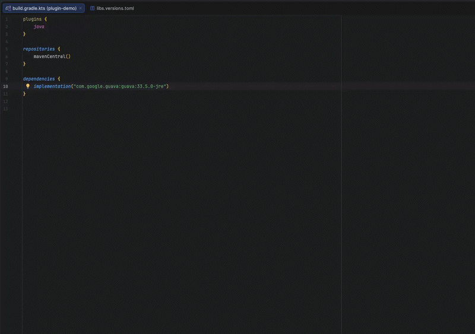

# Move to version catalog

IntelliJ plugin that adds a single, focused intention for Gradle Kotlin DSL projects: move a
hardcoded dependency or plugin coordinate from `build.gradle.kts` into the Gradle version catalog
at `gradle/libs.versions.toml`.

## What it does

- Adds the coordinate under `[libraries]` (for `dependencies { }`) or `[plugins]`
  (for `plugins { }`) in `libs.versions.toml`.
- Replaces the call site with `libs.<alias>` or `alias(libs.plugins.<alias>)`.

## Suggested alias

When you trigger the intention, a dialog pre-fills a suggested alias that you can accept or edit.

For libraries the default is the coordinate's artifact name (`com.google.guava:guava:33.0.0` →
`guava`).

For plugins, a small set of well-known ids is mapped to friendlier aliases:

| Plugin id                                        | Suggested alias        |
|--------------------------------------------------|------------------------|
| `org.jetbrains.kotlin.jvm`                       | `kotlin`               |
| `org.jetbrains.kotlin.android`                   | `kotlin-android`       |
| `org.jetbrains.kotlin.multiplatform`             | `kotlin-multiplatform` |
| `org.jetbrains.kotlin.js`                        | `kotlin-js`            |
| `org.jetbrains.kotlin.native`                    | `kotlin-native`        |
| `org.jetbrains.kotlin.plugin.*` (e.g. `.spring`) | `kotlin-<suffix>`      |
| `com.android.application`                        | `android-application`  |
| `com.android.library`                            | `android-library`      |
| anything else                                    | last id segment        |

The exact-match table lives in
[`src/main/resources/well-known-plugin-aliases.properties`](src/main/resources/well-known-plugin-aliases.properties) —
contributions welcome.
